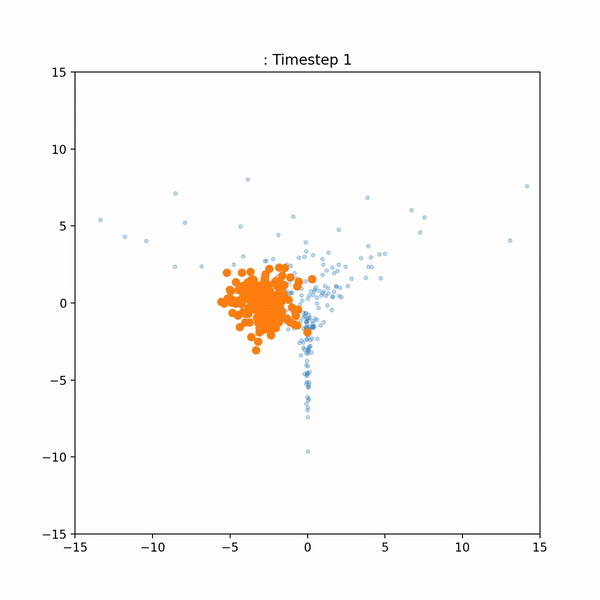
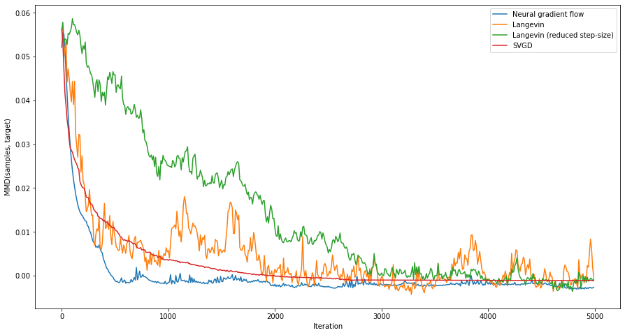

# Neural Variational Gradient Descent

Code for the paper [Neural Variational Gradient Descent](https://arxiv.org/abs/2107.10731).

## Setup

The main framework used in this project is [JAX](https://github.com/google/jax) (version `jax==0.2.7` and `jaxlib==0.1.57`)
See the [installation instructions](https://github.com/google/jax#installation) to install it with proper accelerator support.

Optionally (necessary for some of the experiments) install `tensorflow_datasets==4.2.0` and tensorflow 2.0.

To clone this project and install it, run

```
git clone git@github.com:ratschlab/projects-2020-Neural-SVGD.git
cd projects-2020-Neural-SVGD
pip install -e .
```

## Structure

The implementation is contained in the `nvgd/src` folder. The files are structured as follows:

* `distributions.py`: a set of classes that bundle together all attributes and methods associated with a probability distribution (e.g. mean, variance, sampling, computing the likelihood and loglikelihood).
* `flows.py`: implements functions to simulate the particle dynamics, using the models in `models.py`
* `kernels.py`: a set of positive definite kernel functions.
* `metrics.py`: utilities for computing metrics to track convergence to the target (e.g. MMD distance or mean squared error).
* `models.py`: this is the heart of the project. Contains different models that each compute a single iteration of their respective particle dynamics.
* `nets.py`: neural network architectures.
* `plot.py`: utility functions for plotting.
* `stein.py`: implementations of the Stein operator, (kernelized) Stein discrepancy, and associated methods.
* `utils.py`: miscellaneous utility functions.


## Overview

Many standard MCMC methods such as Hamiltonian Monte Carlo don't work well in settings with large data-sets and high-dimensional target posteriors with complicated dependencies. This is why usually simpler methods such as variational inference (VI) or stochastic gradient Langevin dynamics (SGLD) are applied to this type of problem (e.g. training a Bayesian neural network).

In 2016, Quang Liu and Dilin Wang proposed Stein variational gradient descent (SVGD), a new kind of inference method that rapidly became popular. SVGD transports a set of $n$ samples (called 'particles') along a trajectory that (approximately) minimizes the KL divergence to the target. In contrast to most Markov chain Monte Carlo (MCMC) methods, it does so by leveraging interactions ('repulsive forces') between the particles. Here's an animation of the process (the blue samples represent the target density):



A drawback of SVGD is that it is dependent on the choice of a kernel function. If this kernel is not chosen well, the method may converge badly or not at all. The goal of this project was to build an alternative to SVGD that does not depend on a choice of kernel. Here's a side-by-side visual comparison of our method ('neural gradient flow') and SVGD:


Here are the results (on the same task as in the gif) in a more interpretable form, plus a comparison with Langevin dynamics (smaller MMD is better). In this task and in others, our method outperforms or matches SVGD.




